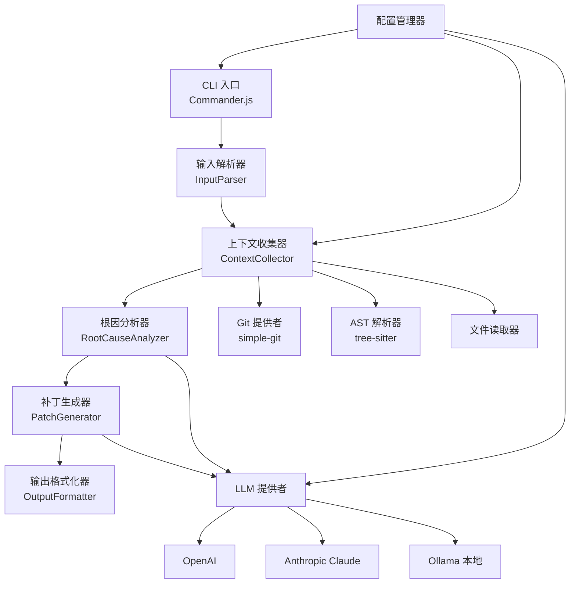
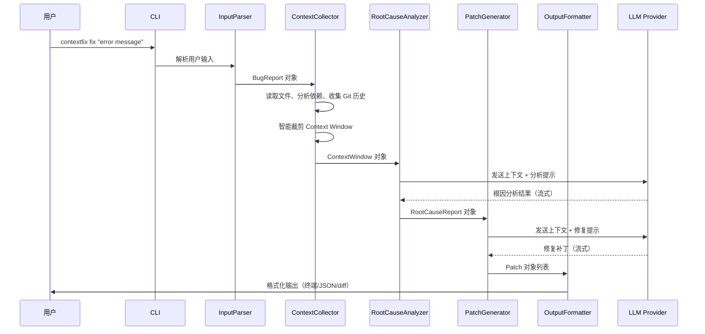
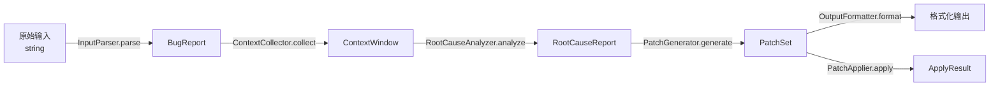

# 技术设计文档 — ContextFix

## 概述

ContextFix 是一个基于 TypeScript + Node.js 的上下文感知 AI 修 Bug 助手 CLI 工具。与市面上 Python 生态的同类工具（SWE-agent、RepairAgent）不同，ContextFix 以 TypeScript 原生实现为差异化定位，面向 Node.js 开发者提供零配置的 `npx contextfix` 使用体验。

系统采用管道式架构，将修 Bug 流程拆解为四个核心阶段：输入解析 → 上下文收集 → 根因分析 → 补丁生成。每个阶段由独立模块负责，通过类型安全的接口串联，确保可测试性和可扩展性。

关键技术选型：
- CLI 框架：Commander.js
- AI 模型：统一 LLM Provider 接口，支持 OpenAI / Anthropic Claude / Ollama
- 代码解析：tree-sitter（跨语言 AST 解析）
- Git 集成：simple-git
- 构建：tsup（基于 esbuild）
- 测试：Vitest + fast-check
- 包管理：pnpm，发布到 npm

## 架构

### 系统架构图



### 管道流程图



### 目录结构

```
contextfix/
├── src/
│   ├── cli.ts                  # CLI 入口，Commander.js 配置
│   ├── pipeline.ts             # 管道编排器
│   ├── input/
│   │   ├── parser.ts           # 输入解析器
│   │   └── validators.ts       # 输入验证
│   ├── context/
│   │   ├── collector.ts        # 上下文收集器
│   │   ├── git-provider.ts     # Git 历史收集
│   │   ├── ast-parser.ts       # tree-sitter AST 解析
│   │   ├── dependency-resolver.ts  # 依赖关系解析
│   │   ├── relevance-scorer.ts # 相关性评分算法
│   │   └── languages/          # 语言特定解析器
│   │       ├── registry.ts     # 语言解析器注册表
│   │       ├── typescript.ts
│   │       ├── python.ts
│   │       ├── java.ts
│   │       ├── go.ts
│   │       └── rust.ts
│   ├── analyzer/
│   │   └── root-cause.ts       # 根因分析器
│   ├── patch/
│   │   ├── generator.ts        # 补丁生成器
│   │   └── applier.ts          # 补丁应用器
│   ├── llm/
│   │   ├── provider.ts         # LLM 统一接口
│   │   ├── openai.ts           # OpenAI 实现
│   │   ├── anthropic.ts        # Claude 实现
│   │   └── ollama.ts           # Ollama 实现
│   ├── config/
│   │   ├── manager.ts          # 配置管理器
│   │   ├── schema.ts           # 配置 schema 定义
│   │   └── serializer.ts       # YAML 序列化/反序列化
│   └── output/
│       ├── formatter.ts        # 输出格式化器
│       ├── terminal.ts         # 终端彩色输出（chalk）
│       └── json.ts             # JSON 输出
├── tests/
│   ├── unit/                   # 单元测试
│   └── property/               # 属性测试（fast-check）
├── package.json
├── tsconfig.json
├── tsup.config.ts
└── vitest.config.ts
```

## 组件与接口

### 1. CLI 入口 (`cli.ts`)

使用 Commander.js 定义命令行接口，负责参数解析和管道编排。

```typescript
// 主命令定义
interface CLIOptions {
  model: string;          // AI 模型标识，默认 "openai:gpt-4"
  contextLimit: number;   // Context Window 最大 token 数，默认 8000
  verbose: boolean;       // 详细日志模式
  output: string | null;  // 输出文件路径，null 表示 stdout
  apply: boolean;         // 是否直接应用补丁
  dryRun: boolean;        // 预览模式
  json: boolean;          // JSON 输出格式
}
```

### 2. 输入解析器 (`input/parser.ts`)

负责将用户输入（错误信息、堆栈追踪、自然语言描述）解析为结构化的 `BugReport` 对象。

```typescript
interface InputParser {
  /** 从原始文本解析 BugReport */
  parse(raw: string, source: InputSource): ParseResult<BugReport>;
  
  /** 验证 BugReport 是否包含足够信息 */
  validate(report: BugReport): ValidationResult;
}

type InputSource = 'cli-arg' | 'stdin' | 'file';

interface ParseResult<T> {
  success: boolean;
  data?: T;
  errors?: ParseError[];
}

interface ParseError {
  field: string;
  message: string;
  suggestion?: string;
}
```

解析策略：
- 正则匹配提取文件路径（如 `/path/to/file.ts:42`）
- 正则匹配提取错误类型（如 `TypeError`, `ReferenceError`）
- 堆栈追踪按 `at` 关键字逐行解析
- 自然语言描述通过关键词提取（文件名、函数名模式匹配）

### 3. 上下文收集器 (`context/collector.ts`)

核心模块，负责从代码仓库中收集与 Bug 相关的所有上下文信息。

```typescript
interface ContextCollector {
  /** 收集完整上下文 */
  collect(report: BugReport, config: ContextConfig): Promise<ContextWindow>;
}

interface ContextConfig {
  maxTokens: number;
  repoPath: string;
  gitHistoryDepth: number;  // 默认 10
  ignorePatterns: string[];
}
```

#### 3.1 Git 提供者 (`context/git-provider.ts`)

```typescript
interface GitProvider {
  /** 获取文件的最近 N 次提交历史 */
  getFileHistory(filePath: string, limit: number): Promise<GitCommit[]>;
  
  /** 获取文件的 blame 信息 */
  getBlame(filePath: string, startLine: number, endLine: number): Promise<BlameLine[]>;
  
  /** 检查文件是否被 .gitignore 忽略 */
  isIgnored(filePath: string): Promise<boolean>;
}
```

#### 3.2 AST 解析器 (`context/ast-parser.ts`)

使用 tree-sitter 进行跨语言 AST 解析，提供统一的依赖分析接口。

```typescript
interface ASTParser {
  /** 解析文件并返回 AST 信息 */
  parse(filePath: string, content: string): ASTInfo;
  
  /** 提取文件的 import/依赖声明 */
  extractImports(filePath: string, content: string): ImportDeclaration[];
}

interface ASTInfo {
  language: SupportedLanguage;
  imports: ImportDeclaration[];
  exports: ExportDeclaration[];
  functions: FunctionDeclaration[];
  classes: ClassDeclaration[];
}

interface ImportDeclaration {
  source: string;       // 导入来源（模块路径）
  specifiers: string[]; // 导入的具体标识符
  line: number;
  isRelative: boolean;  // 是否为相对路径导入
}
```

#### 3.3 语言解析器注册表 (`context/languages/registry.ts`)

插件式架构，每种语言的解析器独立注册。

```typescript
interface LanguageParser {
  /** 支持的语言标识 */
  language: SupportedLanguage;
  
  /** 支持的文件扩展名 */
  extensions: string[];
  
  /** 解析 import 语句 */
  parseImports(content: string): ImportDeclaration[];
  
  /** 解析项目配置文件以获取依赖信息 */
  parseProjectConfig?(configPath: string): ProjectDependency[];
}

type SupportedLanguage = 'typescript' | 'javascript' | 'python' | 'java' | 'go' | 'rust';

class LanguageRegistry {
  register(parser: LanguageParser): void;
  getParser(language: SupportedLanguage): LanguageParser | undefined;
  detectLanguage(filePath: string): SupportedLanguage | undefined;
}
```

#### 3.4 相关性评分算法 (`context/relevance-scorer.ts`)

Context Window 智能裁剪的核心算法。对每个候选文件计算与 Bug 的相关性分数，按分数排序后裁剪至 token 限制内。

```typescript
interface RelevanceScorer {
  /** 计算文件与 Bug 的相关性分数 */
  score(file: CandidateFile, report: BugReport): number;
}

interface CandidateFile {
  path: string;
  content: string;
  tokenCount: number;
  metadata: FileMetadata;
}

interface FileMetadata {
  mentionedInReport: boolean;   // 是否在 Bug 报告中被直接提及
  importDepth: number;          // 与报告文件的依赖距离（0=直接提及，1=直接依赖，2=间接依赖）
  recentCommitCount: number;    // 最近提交次数
  hasErrorTrace: boolean;       // 是否出现在错误堆栈中
}
```

评分公式：
```
score = w1 * mentionedInReport     // 权重 0.4，直接提及
      + w2 * (1 / (importDepth+1)) // 权重 0.3，依赖距离衰减
      + w3 * hasErrorTrace          // 权重 0.2，堆栈追踪出现
      + w4 * normalize(recentCommitCount) // 权重 0.1，最近活跃度
```

裁剪算法：
1. 对所有候选文件计算相关性分数
2. 按分数降序排列
3. 从高到低依次加入 Context Window，直到 token 总数达到限制
4. 对最后一个超限文件，裁剪到函数/类级别粒度（保留包含 Bug 相关行的函数）

### 4. 根因分析器 (`analyzer/root-cause.ts`)

通过 LLM 分析上下文，生成结构化的根因分析报告。

```typescript
interface RootCauseAnalyzer {
  /** 分析根因，支持流式输出 */
  analyze(
    context: ContextWindow,
    report: BugReport,
    options: AnalyzeOptions
  ): AsyncIterable<AnalysisChunk>;
}

interface AnalyzeOptions {
  maxCandidates: number;  // 最大候选根因数，默认 3
  stream: boolean;        // 是否流式输出
}

interface AnalysisChunk {
  type: 'progress' | 'candidate' | 'complete';
  data: string | RootCauseCandidate | RootCauseReport;
}
```

### 5. 补丁生成器 (`patch/generator.ts`)

基于根因分析结果，通过 LLM 生成修复补丁。

```typescript
interface PatchGenerator {
  /** 生成修复补丁 */
  generate(
    report: RootCauseReport,
    context: ContextWindow,
    options: GenerateOptions
  ): AsyncIterable<PatchChunk>;
}

interface GenerateOptions {
  maxPatches: number;     // 最大候选补丁数，默认 1
  stream: boolean;
}

interface PatchChunk {
  type: 'progress' | 'patch' | 'complete';
  data: string | Patch | PatchSet;
}
```

### 6. 补丁应用器 (`patch/applier.ts`)

负责将生成的补丁应用到文件系统。

```typescript
interface PatchApplier {
  /** 应用补丁到文件系统 */
  apply(patch: Patch, repoPath: string): Promise<ApplyResult>;
  
  /** 预览补丁变更（dry-run） */
  preview(patch: Patch, repoPath: string): Promise<PreviewResult>;
}

interface ApplyResult {
  success: boolean;
  filesModified: string[];
  linesAdded: number;
  linesDeleted: number;
  conflicts?: ConflictInfo[];
}

interface ConflictInfo {
  filePath: string;
  reason: string;
  suggestion: string;
}
```

### 7. LLM 统一接口 (`llm/provider.ts`)

抽象层，统一不同 AI 模型的调用方式。

```typescript
interface LLMProvider {
  /** 模型标识 */
  readonly modelId: string;
  
  /** 发送消息并获取响应（流式） */
  chat(messages: ChatMessage[], options?: LLMOptions): AsyncIterable<string>;
  
  /** 估算 token 数 */
  estimateTokens(text: string): number;
}

interface ChatMessage {
  role: 'system' | 'user' | 'assistant';
  content: string;
}

interface LLMOptions {
  temperature: number;    // 默认 0.2（修 Bug 需要确定性）
  maxTokens: number;
  stream: boolean;
}

/** 工厂函数，根据模型标识创建对应的 Provider */
function createLLMProvider(modelId: string, apiKey: string): LLMProvider;
// modelId 格式: "openai:gpt-4", "anthropic:claude-3-sonnet", "ollama:codellama"
```

### 8. 配置管理器 (`config/manager.ts`)

负责配置文件的加载、合并和验证。

```typescript
interface ConfigManager {
  /** 加载合并后的配置（项目级 > 全局级 > 默认值） */
  load(repoPath: string): Promise<Configuration>;
  
  /** 验证配置对象 */
  validate(config: unknown): ValidationResult;
}
```

### 9. 配置序列化器 (`config/serializer.ts`)

负责 YAML 配置文件的解析和序列化，确保往返一致性。

```typescript
interface ConfigSerializer {
  /** 将 YAML 字符串解析为 Configuration 对象 */
  parse(yaml: string): ParseResult<Configuration>;
  
  /** 将 Configuration 对象序列化为 YAML 字符串 */
  serialize(config: Configuration): string;
}
```

### 10. 输出格式化器 (`output/formatter.ts`)

根据输出目标（终端/管道/文件）和用户选项，格式化输出内容。

```typescript
interface OutputFormatter {
  /** 格式化根因分析报告 */
  formatAnalysis(report: RootCauseReport): string;
  
  /** 格式化补丁 */
  formatPatch(patch: Patch): string;
  
  /** 格式化应用结果 */
  formatApplyResult(result: ApplyResult): string;
}

type OutputMode = 'terminal' | 'json' | 'plain';

function createFormatter(mode: OutputMode): OutputFormatter;
```

自动检测逻辑：当 `process.stdout.isTTY` 为 `false` 时（管道/文件重定向），自动切换到 `plain` 模式，禁用彩色输出和进度指示器。

## 数据模型

### 核心数据类型

```typescript
/** Bug 报告 — 输入解析器的输出 */
interface BugReport {
  rawInput: string;                    // 原始输入文本
  source: InputSource;                 // 输入来源
  errorType?: string;                  // 错误类型（如 TypeError）
  errorMessage?: string;               // 错误信息
  filePaths: FileReference[];          // 提取的文件路径引用
  stackTrace?: StackFrame[];           // 解析后的堆栈追踪
  keywords: string[];                  // 提取的关键词（函数名、变量名等）
  description?: string;                // 自然语言描述
}

interface FileReference {
  path: string;
  line?: number;
  column?: number;
}

interface StackFrame {
  filePath: string;
  functionName?: string;
  line: number;
  column?: number;
}

/** 上下文窗口 — 传递给 LLM 的上下文集合 */
interface ContextWindow {
  files: ContextFile[];                // 收集的文件内容
  gitHistory: GitCommit[];             // 相关 Git 历史
  projectInfo: ProjectInfo;            // 项目元信息
  totalTokens: number;                 // 总 token 数
  bugReport: BugReport;                // 原始 Bug 报告
}

interface ContextFile {
  path: string;
  content: string;                     // 文件内容（可能被裁剪）
  relevanceScore: number;              // 相关性分数
  tokenCount: number;
  isTruncated: boolean;                // 是否被裁剪
  truncationReason?: string;
}

interface GitCommit {
  hash: string;
  message: string;
  author: string;
  date: Date;
  filesChanged: string[];
  diff?: string;
}

interface ProjectInfo {
  name: string;
  language: SupportedLanguage;
  packageManager?: string;
  dependencies: Record<string, string>;
  configFiles: string[];
}

/** 根因分析报告 */
interface RootCauseReport {
  candidates: RootCauseCandidate[];    // 候选根因列表（按置信度排序）
  summary: string;                     // 总结
}

interface RootCauseCandidate {
  rank: number;                        // 排名
  confidence: number;                  // 置信度 0-1
  location: FileReference;             // 问题定位
  description: string;                 // 根因描述
  impact: string;                      // 影响范围
  evidence: Evidence[];                // 支撑证据
}

interface Evidence {
  type: 'code-snippet' | 'git-history' | 'dependency';
  content: string;
  source: string;                      // 来源文件/提交
}

/** 修复补丁 */
interface Patch {
  id: string;
  description: string;                 // 修复说明
  changes: FileChange[];               // 文件变更列表
  pros?: string[];                     // 优点（多候选时）
  cons?: string[];                     // 缺点（多候选时）
}

interface FileChange {
  filePath: string;
  hunks: DiffHunk[];                   // diff 块
  explanation: string;                 // 该文件变更的说明
}

interface DiffHunk {
  oldStart: number;
  oldLines: number;
  newStart: number;
  newLines: number;
  content: string;                     // unified diff 格式内容
}

interface PatchSet {
  patches: Patch[];
  recommended: number;                 // 推荐的补丁索引
}

/** 配置 */
interface Configuration {
  model: string;                       // 模型标识，如 "openai:gpt-4"
  apiKey?: string;                     // API 密钥
  contextLimit: number;                // Context Window token 上限，默认 8000
  ignorePatterns: string[];            // 忽略文件模式
  promptTemplates?: Record<string, string>; // 自定义提示词模板
}

/** 验证结果 */
interface ValidationResult {
  valid: boolean;
  errors: ValidationError[];
  warnings: string[];
}

interface ValidationError {
  field: string;
  message: string;
  line?: number;
  suggestion?: string;
}
```

### 数据流转关系



## 正确性属性（Correctness Properties）

以下属性将通过 fast-check 属性测试进行验证。

### P1: 输入解析完整性

对于任意包含文件路径模式 `path:line` 的字符串，`InputParser.parse()` 必须提取出所有文件路径引用。

```
∀ input ∈ String, 包含 N 个 `filepath:line` 模式:
  parse(input).filePaths.length >= N
```

### P2: 配置往返一致性

对于任意合法的 `Configuration` 对象，序列化为 YAML 后再解析回来，必须产生等价的对象。

```
∀ config ∈ ValidConfiguration:
  parse(serialize(config)) ≡ config
```

### P3: 上下文窗口 Token 限制

对于任意 `ContextWindow`，其总 token 数不得超过配置的上限。

```
∀ contextWindow ∈ ContextWindow, limit ∈ PositiveInteger:
  collect(report, {maxTokens: limit}).totalTokens <= limit
```

### P4: 相关性评分有界性

对于任意候选文件，相关性评分必须在 [0, 1] 范围内。

```
∀ file ∈ CandidateFile, report ∈ BugReport:
  0 <= score(file, report) <= 1
```

### P5: 补丁格式合法性

对于任意生成的 `Patch`，其 unified diff 格式必须可被标准 diff 工具解析。

```
∀ patch ∈ Patch:
  isValidUnifiedDiff(formatPatch(patch)) == true
```

### P6: 直接提及文件优先

在 Bug 报告中直接提及的文件，其相关性分数必须高于未提及的文件。

```
∀ mentioned ∈ {f | f.mentionedInReport == true},
  unmentioned ∈ {f | f.mentionedInReport == false}:
  score(mentioned, report) > score(unmentioned, report)
  (当其他条件相同时)
```

### P7: 堆栈追踪解析顺序保持

对于任意包含堆栈追踪的输入，解析后的 `StackFrame` 数组必须保持原始调用顺序。

```
∀ input 包含 stacktrace with frames [f1, f2, ..., fn]:
  parse(input).stackTrace == [f1, f2, ..., fn] (顺序一致)
```

### P8: 配置合并优先级

项目级配置的字段值必须覆盖全局配置的同名字段值。

```
∀ projectConfig, globalConfig ∈ Configuration:
  ∀ field ∈ projectConfig 且 field ∈ globalConfig:
    merge(projectConfig, globalConfig)[field] == projectConfig[field]
```

### P9: .gitignore 过滤一致性

被 .gitignore 忽略的文件不得出现在 ContextWindow 中。

```
∀ file ∈ ContextWindow.files:
  isIgnored(file.path) == false
```

### P10: 输出模式自动检测

当 stdout 不是 TTY 时，输出不得包含 ANSI 转义序列。

```
WHEN process.stdout.isTTY == false:
  ∀ output ∈ formattedOutput:
    containsAnsiEscapes(output) == false
```
